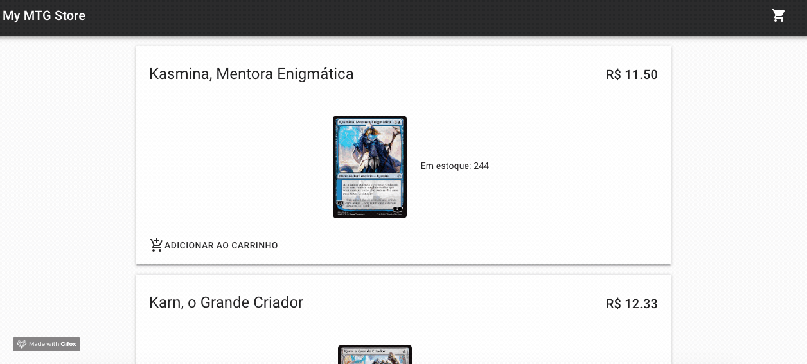

This project was bootstrapped with [Create React App](https://github.com/facebook/create-react-app).

Live version: https://mtg-shop-client.herokuapp.com/

### Major Notes

This project uses React and Relay(Graphql) for the client side. For the server side check: https://github.com/brunomguimaraes/my-mtg-server, it uses Apollo Server, sequelize and a Postgres DB. 
Or if you are familiar with graphCool, check: https://github.com/brunomguimaraes/my-mtg-shop/tree/graphcool_client.

For style, MaterialUI was used.

## Available Scripts

In the project directory, you can run:

### `npm start`

Runs the app in the development mode. 
Open [http://localhost:3000](http://localhost:3000) to view it in the browser.

The page will reload if you make edits. 
You will also see any lint errors in the console.

### `npm test`

Launches the test runner in the interactive watch mode. 
See the section about [running tests](https://facebook.github.io/create-react-app/docs/running-tests) for more information.

### `npm run build`

Builds the app for production to the `build` folder. 
It correctly bundles React in production mode and optimizes the build for the best performance.

The build is minified and the filenames include the hashes. 
Your app is ready to be deployed!

See the section about [deployment](https://facebook.github.io/create-react-app/docs/deployment) for more information.
